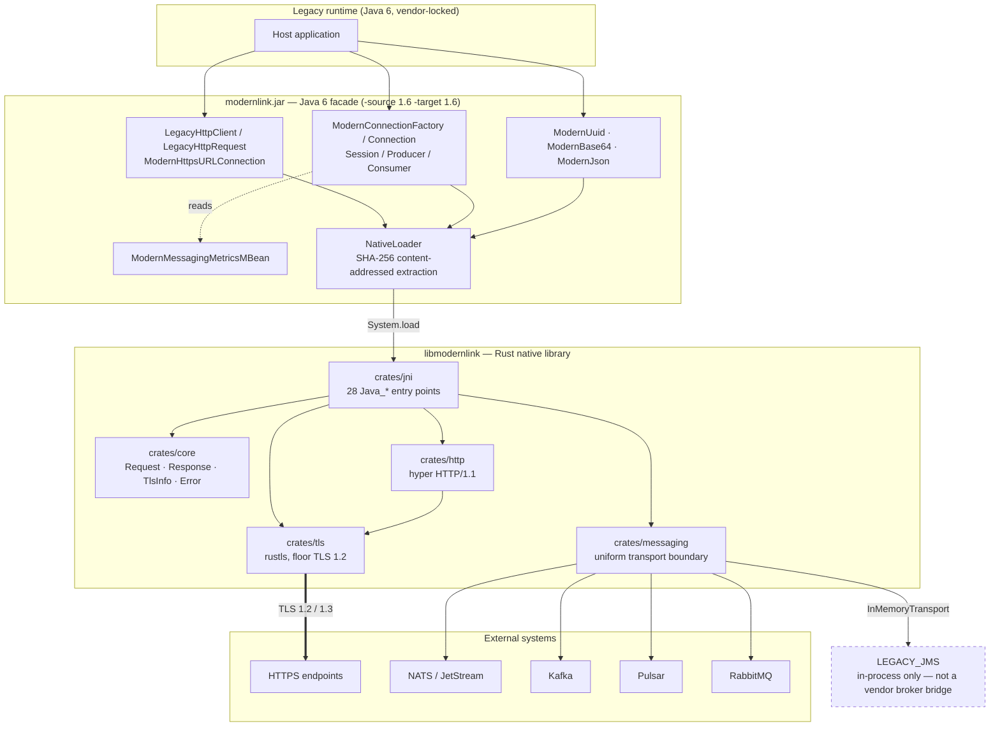
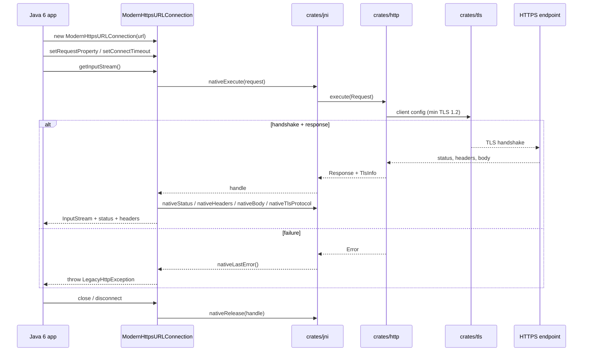
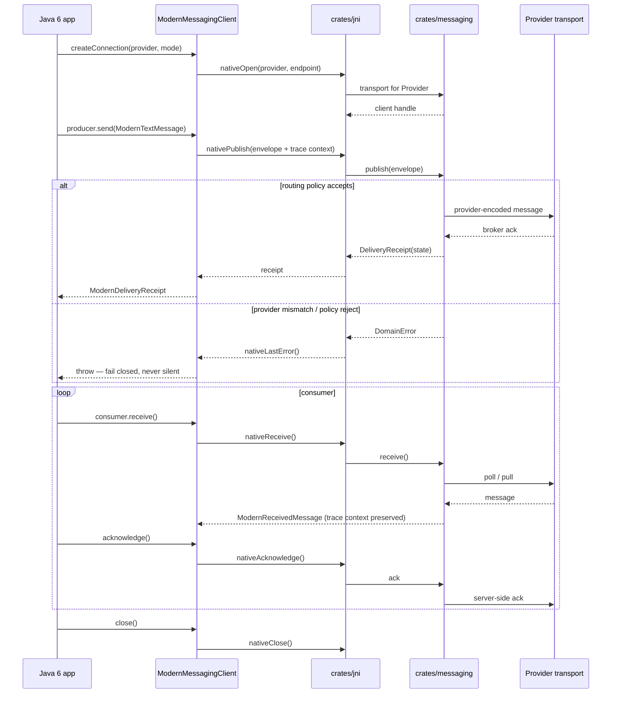
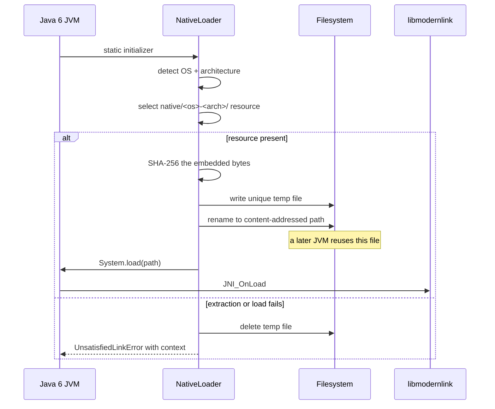
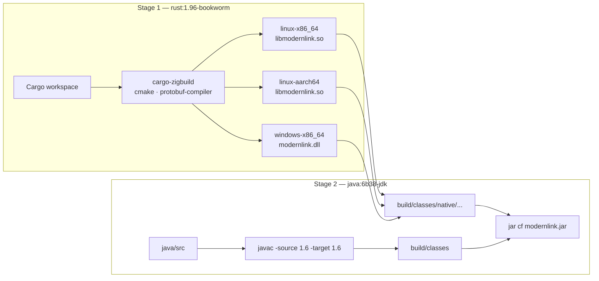

# Architecture
<!-- rev:004 (RFC 3339) 2026-08-21T00:00:00Z -->

Diagrams reflect the current component boundaries. Execution reach is tracked separately in
[VERIFICATION.md](VERIFICATION.md); a drawn path is not runtime evidence.

## System overview



## HTTPS request flow



Timeouts cover both TCP connection and the TLS handshake. Custom `HostnameVerifier` and
`SSLSocketFactory` are rejected rather than ignored — Rust terminates and verifies TLS, so
accepting them would be a misleading security contract.

## Messaging publish / receive / acknowledge



## Native library lifecycle



## Build and packaging



`docker/java6/Dockerfile` is the only supported way to compile and package the Java facade —
there is no Maven or Gradle build. The `java:6b38-jdk` base image is deprecated and may not be
pullable from every registry; see [ISSUES.md](ISSUES.md).

## Source layout

```text
crates/core           package `modernlink-core` - shared request/response, TLS metadata, errors
crates/http           HTTPS execution (hyper)
crates/tls            TLS policy boundary (rustls, webpki-roots)
crates/messaging      InMemory · NATS · JetStream · Kafka · Pulsar · RabbitMQ transports,
                      each behind a cargo feature; default = none (SC-07)
crates/jni            package `jni-bridge` - 28 Java_* entry points; builds libmodernlink
hacks/messaging-demo  executable contract fixtures (Rust, 7 binaries)
hacks/java6-messaging Java 6 JMS/JMX-shaped fixture (4 classes)
java/src/main/java    com.modernlink facade (35 classes)
java/src/test/java    standalone main-style tests (15 classes)
docker/java6          the packaging build

The two package names differ from their folders on purpose: bare `core` shadowed Rust's
built-in crate and bare `jni` shadowed the external `jni` dependency. See ISSUES I-001/I-002.
```
