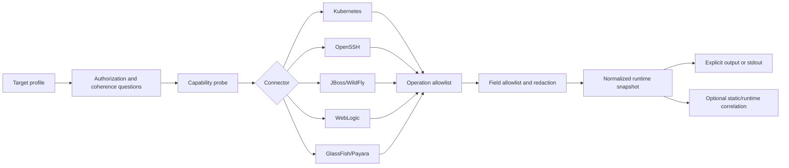

# ModernLink Runtime Observation Design

Date: 2026-08-23
Status: approved architecture; implementation planning pending review of this written specification

## Purpose

Add a runtime-observation subsystem to the ModernLink CLI/plugin preparation ecosystem. It connects
to operator-authorized Kubernetes clusters, Linux machines, JBoss EAP/WildFly, Oracle WebLogic,
and GlassFish/Payara installations, collects bounded read-only evidence, and correlates that live
state with repository evidence without changing the observed environment.

This subsystem belongs only under `cli/`. It must never become a dependency, workspace member,
native artifact, or transitive concern of the ModernLink Java 6 compatibility library.

## Approved decisions

- Support Kubernetes and Linux/OpenSSH in the first connector layer.
- Add dedicated JBoss/WildFly, WebLogic, and GlassFish/Payara adapters.
- Use native read-only protocol adapters with controlled external-tool fallbacks.
- Collect metadata by default; require explicit per-run approval for each deep-inspection category.
- Resolve credentials through existing configuration, an OS keyring, an external credential
  helper, or a masked prompt. Never store credential values in profiles.
- Permit temporary loopback-only `kubectl port-forward` and SSH tunnels after explicit approval.
- Never deploy an agent or modify the target.
- Persist snapshots only when the operator supplies an output path. Otherwise emit the redacted
  result to stdout.
- Negotiate capabilities from the live target rather than trusting product version strings.

## Non-goals

- General-purpose cluster administration, deployment, configuration, remediation, or restart.
- Port scanning, subnet discovery, neighboring-host discovery, or credential discovery.
- Kubernetes mutation, pod execution, secret retrieval, or automatic log collection.
- Arbitrary SSH commands, JMX operations, DMR operations, WLST commands, or `asadmin` commands.
- Bundling proprietary Oracle client JARs or application-server distributions.
- Proving that a deployment is healthy, correctly configured, or safe to migrate.
- Merging volatile runtime observations into the immutable repository evidence graph.

## Domain boundary

```text
ModernLink runtime library
  Java 6 facade -> JNI -> Rust protocol bridge
  no CLI/runtime-observer dependency

ModernLink preparation ecosystem
  plugin interview -> binary pointer -> CLI
                                  |
                                  +-> repository analyzer
                                  +-> runtime observer
                                  +-> static/runtime correlator
```

The new Rust workspace shape is:

```text
cli/crates/
├── analyzer/             # existing repository/CST evidence
├── runtime-observer/     # profiles, connectors, redaction, snapshots
└── modernlink-cli/       # typed command surface only
```

`runtime-observer` depends on no root-workspace crate. The CLI may depend on both `analyzer` and
`runtime-observer`, but neither crate depends on the other. Static/runtime correlation consumes
their serialized contracts at the CLI orchestration boundary.

## Data flow



## Core contracts

```rust
pub trait RuntimeConnector {
    fn probe(&self, request: &ProbeRequest) -> Result<CapabilityReport, ObservationError>;
    fn observe_metadata(
        &self,
        request: &ObservationRequest,
    ) -> Result<RuntimeSnapshot, ObservationError>;
    fn observe_deep(
        &self,
        request: &ObservationRequest,
        approvals: &DeepApprovals,
    ) -> Result<RuntimeSnapshot, ObservationError>;
}
```

Connectors receive fully validated typed profiles. They do not receive arbitrary URLs, operations,
remote commands, JSON bodies, MBean names, or vendor-tool arguments from plugin text.

The stable profile schema is `urn:modernlink:schema:runtime-profile:v1`:

```json
{
  "schema_version": "modernlink.runtime-profile/v1",
  "name": "orders-production",
  "kind": "jboss-http",
  "endpoint": "https://management.example.internal:9990",
  "scope": {
    "environment": "production",
    "namespace": null,
    "server_group": "orders"
  },
  "authorization": {
    "owner": "platform-team",
    "reference": "CHG-1042",
    "expires_at": "2026-08-24T00:00:00Z"
  },
  "credential_ref": {
    "kind": "os-keyring",
    "service": "modernlink-runtime",
    "account": "orders-production"
  },
  "tls": {
    "mode": "system-roots",
    "ca_ref": null,
    "pinned_sha256": null
  }
}
```

The profile stores no password, token, private key, cookie, kubeconfig content, or SSH key. SSH
profiles refer to an OpenSSH host alias; Kubernetes profiles refer to a kubeconfig context and
optional namespace. GlassFish `asadmin` fallback may refer to an existing login cache but never
creates or exports one.

## Snapshot model and determinism

The runtime snapshot schema is `modernlink.runtime-observation/v1alpha1` and contains:

- target/profile digest and connector identity;
- captured time and approved observation depth;
- negotiated product family, reported version hints, and capability results;
- normalized cluster, node, server, process, deployment, service, application, health-state, and
  allowlisted metric records;
- observed runtime evidence with collector, target, normalized resource key, accepted-field
  payload digest, and source operation ID;
- unavailable, denied, timed-out, truncated, unsupported, and partial-result records;
- redaction counters by rule, without redacted values;
- tunnel metadata limited to connector type and local lifetime, never remote credentials; and
- a content digest computed over canonical normalized observations, excluding capture time.

Every unordered collection is sorted before serialization. Stable record IDs are length-prefixed
SHA-256 identifiers derived from target profile digest, resource kind, canonical resource key,
source operation, and accepted-field payload digest. Runtime counters and states remain part of the
content digest because a state change is a real observation change.

Raw management responses are held only long enough to parse, allowlist, and redact. The snapshot
never stores them. A response digest is computed only over the accepted redacted field projection;
secret-bearing rejected fields never enter an identifier or digest.

## Epistemic model

- Connector responses after allowlisting become `Observed` runtime evidence.
- Product-family classification and static/runtime mappings become `Derived` claims with rule IDs.
- Bounded-context, ownership, modernization-seam, migration-readiness, and outage explanations
  remain `Hypothesis` until reviewed.
- Authentication denial, missing permission, disabled monitoring, and incomplete cluster reach are
  evidence gaps. They are never converted into healthy, absent, or unused conclusions.

## Command surface

```text
modernlink runtime profile create --kind <kind> --output <profile.json>
modernlink runtime profile validate <profile.json>
modernlink runtime probe --profile <profile.json>
modernlink runtime observe --profile <profile.json> --depth metadata [--output <snapshot.json>]
modernlink runtime observe --profile <profile.json> --depth deep \
  --approve <category> [--approve <category>...] [--output <snapshot.json>]
modernlink runtime correlate --analysis <repository.json> \
  --runtime <snapshot.json> --output <correlation.json>
```

Deep categories are `logs`, `jvm-metrics`, `deployment-descriptors`, and
`sanitized-configuration`. Approval for one category never implies another. Profiles cannot store
deep approvals; every deep run records fresh approval evidence.

Profile creation asks for target ownership, authorization reference/expiry, environment criticality,
allowed scope, product hints, endpoint, TLS policy, credential source, tunnel permission, output
handling, rate/time limits, and prohibited data. The masked prompt fallback occurs only after a
configured credential reference fails or the operator selects it explicitly.

## Common transport rules

- Connect only to the operator-supplied endpoint or host alias.
- Do not scan default ports. Defaults may be displayed as suggestions during profile creation only.
- Enforce hostname verification and certificate validation.
- Reject plaintext HTTP by default. A per-run plaintext exception requires an authorization record
  and produces a high-severity evidence warning.
- Reject cross-origin redirects. Permit same-origin HTTP-to-HTTPS upgrade only.
- Use bounded connect/read/total timeouts, response-size caps, item-count caps, and concurrency.
- Stop repeated authentication attempts after the first definitive 401/403-style response.
- Redact request headers, cookies, credential material, URL userinfo/query values, and response
  fields before diagnostics.
- Distinguish transport failure, authorization failure, unsupported capability, target unhealth,
  and partial observation.

## Kubernetes connector

Use the operator's installed `kubectl` and kubeconfig context in the first implementation. Invoke
only typed `get` operations with JSON output for namespaces, deployments, stateful sets, daemon
sets, pods, services, ingresses, jobs, and cron jobs inside the approved namespace scope. Do not
request Secrets, exec into containers, copy files, mutate resources, or enumerate cluster-wide
resources without explicit cluster scope.

Normalize names, namespaces, UIDs, resource versions, owner references, replica/status counts,
container names/images, restart counts, phases, conditions, and declared ports. Exclude environment
variables, secret/config-map values, projected token paths, annotations with unbounded values, and
managed fields.

`kubectl port-forward` is an optional tunnel provider. Bind to `127.0.0.1`, request an unused local
port, wait for readiness, record the child PID internally, and terminate the child on completion,
cancellation, timeout, or panic recovery. Kubernetes documents `kubectl get` and port forwarding in
its official command reference: [kubectl get](https://kubernetes.io/docs/reference/kubectl/generated/kubectl_get/),
[kubectl port-forward](https://kubernetes.io/docs/reference/kubectl/generated/kubectl_port-forward/).

## Linux/OpenSSH connector

Use the operator's OpenSSH configuration and agent. Pass `BatchMode=yes` when no masked prompt is
authorized, a bounded connect timeout, the configured host alias, and one fixed collector script.
Never interpolate operator text into the remote script.

Metadata mode may collect:

- operating-system/kernel identity;
- process PID, PPID, owner, elapsed time, and executable basename;
- running service unit names and states;
- listening protocol/port and owning PID/name when permitted; and
- application-server deployment filenames, sizes, and timestamps only from explicitly approved
  roots.

Exclude complete command lines, JVM arguments, `/proc/*/environ`, system properties, credential
files, application contents, logs, home-directory traversal, and arbitrary filesystem search.
OpenSSH option behavior is defined by the official manual: [ssh(1)](https://man.openbsd.org/ssh).

Temporary SSH forwarding uses `-N`, loopback-only `-L`, exit-on-forward-failure, and the target host
alias. The child process receives no secret arguments and is cleaned up using the same lifecycle as
Kubernetes forwarding.

## JBoss EAP and WildFly connector

### Negotiated surfaces

| Family | Preferred surface | Compatibility behavior |
|---|---|---|
| JBoss EAP 6/7/8 | HTTP/JSON management model at the configured endpoint | Negotiate model attributes and supported operations |
| WildFly | HTTP/JSON management model | Negotiate from live model; do not hard-code a release range |
| JBoss EAP 5 | SSH-local metadata | Optional future on-host allowlisted JMX helper; never scrape JMX/Admin Console |

EAP 6+ and WildFly commonly expose management HTTP on 9990, but the connector never assumes or
scans that port. EAP 5 JMX/RMI and console surfaces are mutation-capable and use multiple legacy
ports, so direct remote JMX is outside the initial boundary. Official management references:
[EAP 6.4 administration guide](https://docs.redhat.com/en/documentation/red_hat_jboss_enterprise_application_platform/6.4/html-single/administration_and_configuration_guide/index),
[EAP 8.1 management overview](https://docs.redhat.com/en/documentation/red_hat_jboss_enterprise_application_platform/8.1/html/configuration_guide/eap-mgmt-overview_default),
[WildFly 40 Admin Guide](https://docs.wildfly.org/40/Admin_Guide.html).

Capability probing reads root product/management-version/server-state attributes, then uses
`read-resource-description` and non-recursive child discovery. The typed operation allowlist is:

- `read-attribute`;
- `read-resource` with `recursive=false` and metadata-mode `include-runtime=false`;
- `read-resource-description`;
- `read-operation-description`;
- `read-children-types`; and
- `read-children-names`.

GET is preferred. POST is permitted only for a typed, hardcoded DMR read that cannot be represented
as GET. Arbitrary DMR JSON, write operations, reload, shutdown, deploy, content download, unbounded
recursive reads, JNDI traversal, audit logs, JVM arguments, system properties, datasource
credentials/URLs, and security realms are prohibited.

Use a server-side `Monitor` role when available, but maintain client-side allowlists because older
or RBAC-disabled installations may grant broader authority than intended.

## Oracle WebLogic connector

Probe the configured endpoint in this order without scanning:

1. `/management/weblogic` for the 12.2.1+/14c/15 family;
2. `/management/wls` for the 12.1.3 family;
3. `/management/tenant-monitoring/servers` for the 10.3.6 monitoring family; and
4. an explicitly configured operator-supplied Java/JMX helper only when REST is unavailable.

The connector treats product version as a hint; the successful resource family is the capability.
The initial native Rust transport exposes GET only, rejects non-JSON success responses and login
HTML, requests `links=none`, and selects exact fields. Safe metadata includes server/cluster names,
state, health summary, deployment names/states, data-source names/states, and bounded aggregate
counts. JVM heap, uptime, thread-count, and socket-count metrics require `jvm-metrics` approval.

Prefer a WebLogic `Monitor` principal. Administration-port use is an explicit warning because
Oracle documents administrator credentials for that channel. Exclude edit trees, security
configuration, realms/providers/users/groups, JDBC URLs/users/properties, server-start arguments,
system properties, environment, deployment paths/plans/content, Node Manager, diagnostics, logs,
and encrypted-property placeholders.

Official version-family references:
[10.3.6 REST monitoring](https://docs.oracle.com/cd/E23943_01/web.1111/e24682.pdf),
[12.1.3 `/management/wls`](https://docs.oracle.com/middleware/1213/wls/WLRMR/management_wls.htm),
[14.1.2 domain runtime](https://docs.oracle.com/en/middleware/fusion-middleware/weblogic-server/14.1.2/wlrdr/verify-serverRuntime.html),
[15.1.1 REST overview](https://docs.oracle.com/en/middleware/standalone/weblogic-server/15.1.1/wlrur/overview.html).

Pure Rust does not provide a faithful WebLogic T3/JMX client. A later optional helper must use the
operator's matching Oracle client JAR, accept the secret once over inherited stdin, expose only an
allowlisted JSON response, and remain unbundled until Oracle licensing and compatibility are
reviewed. WLST is a last fallback under the same restrictions.

## GlassFish and Payara connector

Connect to the configured Domain Administration Server. Negotiate core admin REST first, installed
`asadmin` second, and JMX only as a future advanced helper. The common default DAS port is 4848 and
JMX port is 8686, but neither is assumed or scanned.

Probe GET `/management/domain` with strict JSON/content/size checks. Discover only explicitly
allowlisted children. Safe metadata includes product/version, application names/types/states,
cluster and instance names/states, and cluster health. Approved monitoring may include JVM uptime,
heap/non-heap aggregate use, loaded-class count, thread count, GC count/time, processor load, and
HTTP request/error/latency aggregates that are already enabled. Never enable monitoring.

If REST is unavailable, invoke only a closed enum of installed `asadmin` commands:

- `version`, rejecting its documented local-version fallback;
- `list-applications --long=false`;
- `list-clusters`;
- `list-instances` without long output; and
- `get-health <approved-cluster>`.

Reuse an existing protected `asadmin` login cache or resolve a credential reference. Never create
password files or pass passwords in argv. Exclude broad configuration trees, JDBC/JNDI/mail
values, JVM options, system properties, realms/users/groups, password aliases, keystore paths,
node SSH configuration, logs, thread/heap dumps, and arbitrary MBeans.

Official references:
[GlassFish 3.1 monitoring REST](https://docs.oracle.com/cd/E18930_01/html/821-2416/gjipx.html),
[GlassFish 5.1 administration](https://glassfish.org/docs/5.1.0/administration-guide/general-administration.html),
[GlassFish 7.1 administration guide](https://glassfish.org/docs/7.1.0/administration-guide.pdf),
[Payara 6 REST-monitoring configuration](https://docs.payara.fish/community/docs/6.2023.6/Technical%20Documentation/Payara%20Server%20Documentation/Command%20Reference/set-rest-monitoring-configuration.html),
[Payara 7 `asadmin`](https://docs.payara.fish/community/docs/7.2026.3/Technical%20Documentation/Payara%20Server%20Documentation/Command%20Reference/asadmin.html).

GlassFish 6 patch behavior and Payara 7-specific REST monitoring remain capability-negotiated
unknowns rather than assumed support.

## Deep inspection

Every deep request requires a fresh approval record containing category, approver, authorization
reference, target/scope digest, reason, and expiry. The plugin asks separate coherence questions for
each category.

- `logs`: selected workload/server only, bounded lookback, line/byte caps, redaction before output.
- `jvm-metrics`: aggregate numeric metrics only; no arguments, properties, stacks, dumps, or class
  paths.
- `deployment-descriptors`: allowlisted descriptor names and structural keys; no embedded resource
  values or full source bodies.
- `sanitized-configuration`: exact product-specific field allowlist; no wildcard trees.

Always prohibited: secrets, credential stores, identity realms, tokens/cookies, private keys,
environment variables, full process/JVM arguments, heap/thread dumps, arbitrary filesystem files,
request/session payloads, arbitrary SQL/JNDI values, and write/invoke operations.

## Redaction

Apply redaction before serialization, logging, error construction, hashing, caching, or plugin
context. Field-name matching is case-insensitive and rejects password, passphrase, secret, token,
credential, authorization, cookie, private key, encrypted, alias, environment, system-properties,
and input-arguments families. Product-specific deny lists run before generic matching.

Bound all accepted strings and arrays. Replace rejected fields with counters and stable reason codes,
not placeholders that disclose length or hash. A connector returning an unexpected field fails
closed unless that field is discarded before the normalized type boundary.

## Static/runtime correlation

Correlation is a separate deterministic stage. Initial rules may link:

- Kubernetes image coordinates to build artifacts;
- deployment/application names to EAR/WAR/module names;
- JBoss server groups or WebLogic clusters to reviewed environment mappings;
- runtime vendor/version observations to repository vendor descriptors/import signals; and
- runtime endpoints to reviewed configuration keys without retaining secret values.

Every link carries both static and runtime evidence IDs plus a rule ID. Name-only links remain
low-confidence hypotheses. No correlation changes either source snapshot.

## Error and partial-result model

Stable error families include invalid profile, expired authorization, credential unavailable,
authentication rejected, authorization denied, TLS failure, plaintext rejected, endpoint mismatch,
capability unsupported, tool missing, tool incompatible, tunnel failure, timeout, response too
large, malformed response, redaction rejection, target unhealthy, partial scope, and internal
invariant failure.

One member failure does not erase other observations. The snapshot records reached/unreached scope,
then exits nonzero for partial results unless `--allow-partial` was explicitly approved. A timeout
or permission denial never means the target resource is absent.

## Testing and real-environment evidence

- Contract tests for profile validation, stable IDs, canonical accepted-field payloads, redaction,
  operation allowlists, approval expiry, partial results, and tunnel cleanup.
- Local controlled HTTP servers for JBoss, WebLogic, and GlassFish resource-family negotiation,
  authentication challenges, redirects, oversized bodies, malformed JSON, and unexpected fields.
- Fake executable fixtures for `kubectl`, OpenSSH, and `asadmin`, asserting exact argv and normalized
  output without credentials.
- Process-boundary CLI tests for stdout-only observation and explicit output behavior.
- Optional operator-run real probes gated by environment variables that contain references, never
  credential values.
- Open-source container/lab probes for WildFly and GlassFish/Payara after the native connector
  exists. WebLogic real probes require an operator-provided licensed installation.

Machine tests remain implementation facts. A maintainer reviews whether observed fields, security
boundaries, and live behavior satisfy the intended environment.

## Implementation slices

1. Runtime model, profile validation, credential-reference interfaces, redaction, snapshot
   canonicalization, and connector trait.
2. Kubernetes connector, SSH connector, temporary tunnel lifecycle, and plugin observation skill.
3. JBoss/WildFly HTTP management connector plus EAP 5 SSH-local profile.
4. WebLogic REST-family negotiation and field normalization.
5. GlassFish/Payara REST connector and `asadmin` fallback.
6. Static/runtime correlation, deep-category collectors, and lifecycle/readiness integration.

Each slice must produce an executable command path before widening its feature set. Release
packaging remains behind real connector execution.

## Research provenance

Three delegated discovery agents independently researched JBoss/WildFly, WebLogic, and
GlassFish/Payara using official vendor documentation. Their findings were synthesized into this
design; no vendor or third-party source code, scripts, schemas, or documentation text was copied.

The design preserves explicit unknowns through capability negotiation:

- older WildFly historical-guide coverage is incomplete, so management-model behavior decides;
- WebLogic 12.1.1/12.1.2 legacy REST availability is patch-dependent;
- GlassFish 6 REST/session behavior and Payara 7 REST-monitoring details vary or lack complete
  indexed official evidence; and
- server-side least-privilege role availability remains deployment-specific.
