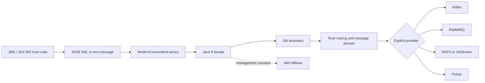

# ModernLink integration samples
<!-- rev:005 (RFC 3339) 2026-08-21T19:45:00Z -->

These samples show the shape of a legacy Java 6 integration. The common path is:

## Files

| File | Shows |
| --- | --- |
| [`legacy-flow.md`](legacy-flow.md) | JMS, JMX, JAXB, and JAX-WS sequence diagrams |
| [`provider-flow.mmd`](provider-flow.mmd) | Standalone Mermaid provider flow for Mermaid-compatible tooling |
| [`JmsToKafka.java`](JmsToKafka.java) | Java 6 JMS-shaped send/receive flow targeting Kafka |
| [`JmxManagement.java`](JmxManagement.java) | Reading safe operational counters through JMX |
| [`JaxbXmlMessage.java`](JaxbXmlMessage.java) | Marshalling a Java 6 JAXB object into a text message |
| [`JaxWsToRabbitMq.java`](JaxWsToRabbitMq.java) | Sending a JAX-WS request into RabbitMQ |
| [`rust-provider-boundary.rs`](rust-provider-boundary.rs) | Provider-neutral Rust guarantee checks |

The Java snippets use Java 6 syntax: explicit types, anonymous `Runnable`/listener
implementations where needed, and ordinary `try`/`finally` cleanup. They assume the
packaged ModernLink JAR is on the class path. The JAX-WS and JAXB snippets also assume
the corresponding Java 6 platform APIs or the host application's generated classes;
those APIs are not dependencies of the ModernLink JAR.

The snippets log identifiers, states, and counters only. They may compare message content in
memory, but they do not write payloads, message bodies, or credentials to logs or JMX attributes.

## Provider and guarantee rules

Use a real endpoint in place of the placeholders. Do not commit credentials or broker
URLs. Provider clients are compiled only when their Cargo feature is enabled, and asking
for a provider that was not compiled in fails closed.

`LEGACY_JMS` is an in-process compatibility transport, not a bridge to a vendor JMS
broker. `TRANSPARENT` mode is therefore paired with `LEGACY_JMS`; modern providers use
`TRANSFORM` or `REDIRECT` mode. Before sending, callers can inspect
`ModernMessagingClient.guaranteesFor(provider)`. The Rust sample explicitly invokes the
fail-closed delivery/acknowledgement helpers as an application-side preflight. The current JNI
publish path does **not** invoke the delivery-mode helper; [B-003](../docs/BUGS.md) tracks that
gap, so callers must not assume persistent delivery is enforced end to end.

The snippets are documentation examples. They do not, by themselves, prove Java 6
runtime loading, vendor-host integration, or broker-backed behavior.
