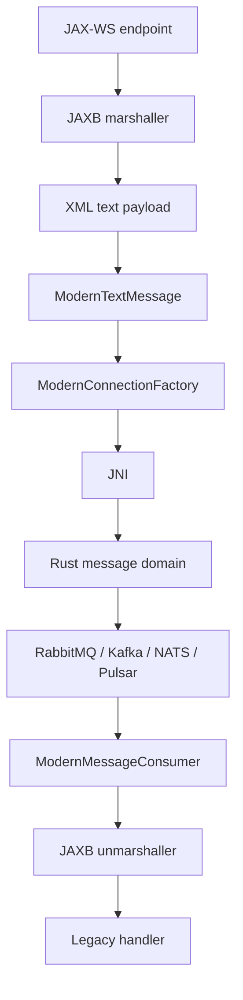

# Legacy API flow
<!-- rev:002 (RFC 3339) 2026-08-21T18:10:15Z -->

The legacy application can keep its existing boundary concerns separate from the
transport choice. JMS-shaped code owns message lifecycle, JMX exposes only operational
counters, JAXB turns a typed object into an explicit text representation, and JAX-WS can
call the same facade from a web-service endpoint.

## Request and message sequence

```mermaid
sequenceDiagram
    participant Host as Java 6 host
    participant JMS as JMS-shaped facade
    participant JMX as JMX MBean
    participant JNI as JNI boundary
    participant Rust as Rust routing/domain
    participant Broker as Kafka/RabbitMQ/NATS/Pulsar

    Host->>JMS: create factory(mode, provider)
    JMS->>JNI: nativeOpen(url, subject, mode, provider)
    JNI->>Rust: open provider-neutral transport
    Rust-->>JNI: handle or fail-closed error
    JNI-->>JMS: ModernConnection
    JMS->>JMX: register counters only
    Host->>JMS: createTextMessage(payload)
    Host->>JMS: producer.send(message)
    JMS->>JNI: publish(message + trace context)
    JNI->>Rust: route; delivery-mode check is pending B-003
    Rust->>Broker: publish
    Broker-->>Rust: provider receipt
    Rust-->>JMS: ModernDeliveryReceipt
    Host->>JMS: consumer.receive()
    JMS->>JNI: receive()
    JNI->>Rust: receive and retain receipt
    Rust->>Broker: consume
    Broker-->>Rust: message
    Rust-->>JMS: message + receipt
    Host->>JMS: acknowledge(receipt)
    JMS->>JNI: acknowledge(receipt)
    JNI->>Rust: provider acknowledgement
    Rust->>Broker: ack/commit
    JMX-->>Host: counts, provider, mode, trace id
```

## JAXB and JAX-WS at the edge



JAXB XML is intentionally shown as text. The current Java facade does not pretend that
an arbitrary Java object can cross the boundary with provider-specific serialization
semantics; unsupported payload categories are refused explicitly.
